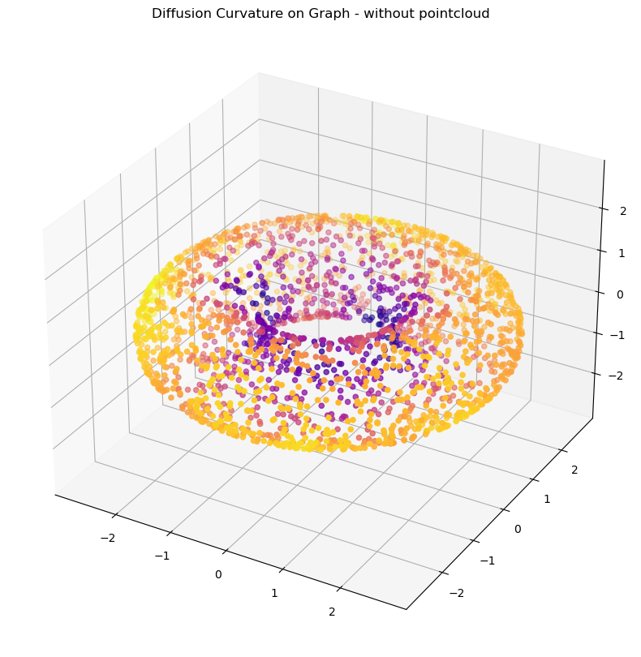
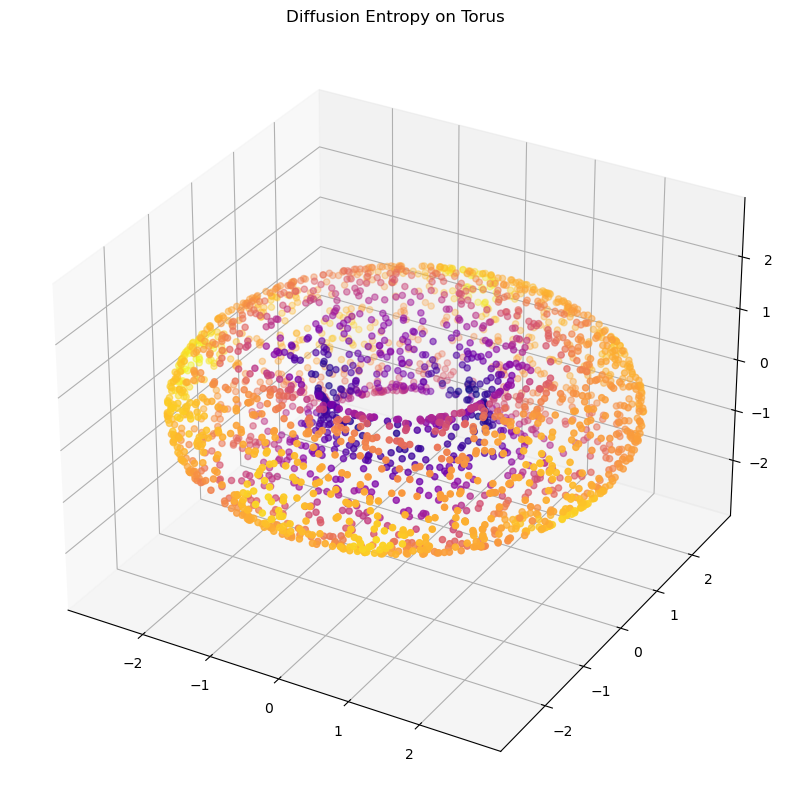

# Diffusion Curvature

> [!Note]
> The newest code for Diffusion Curvature may be found [here](https://github.com/professorwug/diffusion-curvature). This repository is not maintained, and is preserved only as a monument to the past.
> There have since been significant enhancements to the diffusion curvature algorithm.

Diffusion curvature is a pointwise extension of Ollivier-Ricci
curvature, designed specifically for the often messy world of pointcloud
data. Its advantages include:

1.  Unaffected by density fluctuations in data: it inherits the
    diffusion operator’s denoising properties.
2.  Fast, and scalable to millions of points: it depends only on matrix
    powering - no optimal transport required.

## Install

<!-- To install with conda (or better yet, mamba),
```sh
conda install diffusion-curvature -c riddlelabs
``` -->

To install with pip (or better yet, poetry),

``` sh
pip install diffusion-curvature
```

or

``` sh
poetry add diffusion-curvature
```

Conda releases are pending.

## Usage

To compute diffusion curvature, first create a `graphtools` graph with
your data. Graphtools offers extensive support for different kernel
types (if creating from a pointcloud), and can also work with graphs in
the `PyGSP` format. We recommend using `anistropy=1`, and verifying that
the supplied knn value encompasses a reasonable portion of the graph.

``` python
from diffusion_curvature.datasets import torus
import graphtools
X_torus, torus_gaussian_curvature = torus(n=5000)
G_torus = graphtools.Graph(X_torus, anisotropy=1, knn=30)
```

Graphtools offers many additional options. For large graphs, you can
speed up the powering of the diffusion matrix with landmarking: simply
pass `n_landmarks=1000` (e.g) when creating the graphtools graph. If you
enable landmarking, `diffusion-curvature` will automatically use it.

Next, instantiate a
[`DiffusionCurvature`](https://professorwug.github.io/diffusion_curvature/core%20(graphtools).html#diffusioncurvature)
operator.

``` python
from diffusion_curvature.graphtools import DiffusionCurvature
DC = DiffusionCurvature(t=12)
```

------------------------------------------------------------------------

<a
href="https://github.com/professorwug/diffusion_curvature/blob/main/diffusion_curvature/graphtools.py#LNone"
target="_blank" style="float:right; font-size:smaller">source</a>

### DiffusionCurvature

>      DiffusionCurvature (t:int, distance_type='PHATE', dimest=None,
>                          use_entropy:bool=False, **kwargs)

Initialize self. See help(type(self)) for accurate signature.

|               | **Type** | **Default** | **Details**                                                                                                       |
|---------------|----------|-------------|-------------------------------------------------------------------------------------------------------------------|
| t             | int      |             | Number of diffusion steps to use when measuring curvature. TODO: Heuristics                                       |
| distance_type | str      | PHATE       |                                                                                                                   |
| dimest        | NoneType | None        | Dimensionality estimator to use. If None, defaults to KNN with default params                                     |
| use_entropy   | bool     | False       | If true, uses KL Divergence instead of Wasserstein Distances. Faster, seems empirically as good, but less proven. |
| kwargs        |          |             |                                                                                                                   |

And, finally, pass your graph through it. The
[`DiffusionCurvature`](https://professorwug.github.io/diffusion_curvature/core%20(graphtools).html#diffusioncurvature)
operator will store everything it computes – the powered diffusion
matrix, the estimated manifold distances, and the curvatures – as
attributes of your graph. To get the curvatures, you can run `G.ks`.

``` python
G_torus = DC.curvature(G_torus, dimension=2) # note: this is the intrinsic dimension of the data
```

``` python
plot_3d(X_torus, G_torus.ks, colorbar=True, title="Diffusion Curvature on the torus")
```


# Using on a predefined graph

If you have an adjacency matrix but no pointcloud, diffusion curvature
may still be useful. The caveat, currently, is that our intrinsic
dimension estimation doesn’t yet support graphs, so you’ll have to
compute & provide the dimension yourself – if you want a signed
curvature value.

If you’re only comparing relative magnitudes of curvature, you can skip
this step.

For predefined graphs, we use our own
[`ManifoldGraph`](https://professorwug.github.io/diffusion_curvature/core%20(manifoldgraph).html#manifoldgraph)
class. You can create one straight from an adjacency matrix:

``` python
from diffusion_curvature.manifold_graph import ManifoldGraph, diffusion_curvature, diffusion_entropy_curvature, entropy_of_diffusion, wasserstein_spread_of_diffusion, power_diffusion_matrix, phate_distances
from diffusion_curvature.kernels import gaussian_kernel
import numpy as np
```

``` python
# if you want (or have) to compute your own A
A = gaussian_kernel(X_torus, kernel_type="adaptive", k = 20, anisotropic_density_normalization=1)
np.fill_diagonal(A,0)
# initialize the manifold graph; input your computed dimension along with the adjacency matrix
G_pure = ManifoldGraph(A = A, dimension=2, anisotropic_density_normalization=1)
```

``` python
G_pure = diffusion_curvature(G_pure, t=8)
plot_3d(X_torus, G_pure.ks, title = "Diffusion Curvature on Graph - without pointcloud")
```



Alternately, to compute just the *relative magnitudes* of the pointwise
curvatures (without signs), we can directly use either the
[`wasserstein_spread_of_diffusion`](https://professorwug.github.io/diffusion_curvature/core%20(manifoldgraph).html#wasserstein_spread_of_diffusion)
(which computes the $W_1$ distance from a dirac to its t-step
diffusion), or the
[`entropy_of_diffusion`](https://professorwug.github.io/diffusion_curvature/core%20(manifoldgraph).html#entropy_of_diffusion)
function (which computes the entropy of each t-step diffusion). The
latter is nice when the manifold’s geodesic distances are hard to
estimate – it corresponds to replacing the wasserstein distance with the
KL divergence.

Both of these estimate an “inverse laziness” value that is inversely
proportional to curvature. To use magnitude estimations in which the
higher the curvature, the higher the value, we can simply take the
reciprocal of the output.

``` python
# for the wasserstein version, we need manifold distances
G_pure = power_diffusion_matrix(G_pure,t=8)
G_pure = phate_distances(G_pure)
ks_wasserstein = wasserstein_spread_of_diffusion(G_pure)
```

``` python
# for the entropic version, we need only power the diffusion operator
G_pure = power_diffusion_matrix(G_pure, t=8)
ks_entropy = entropy_of_diffusion(G_pure)
```

``` python
plot_3d(X_torus, 1/ks_entropy, title="Diffusion Entropy on Torus")
```


